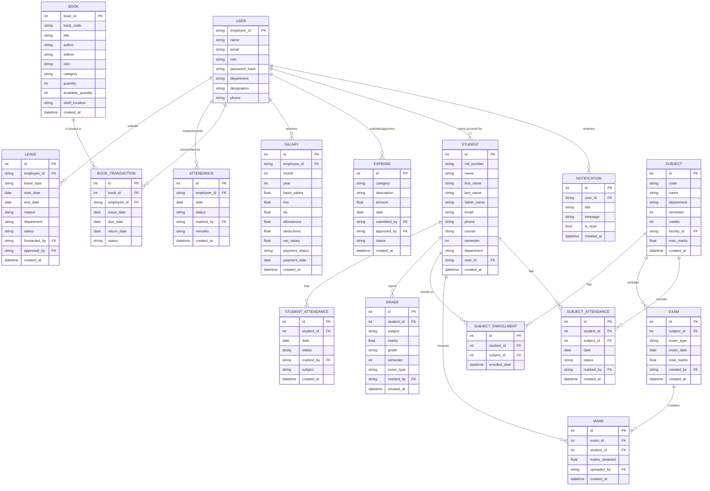
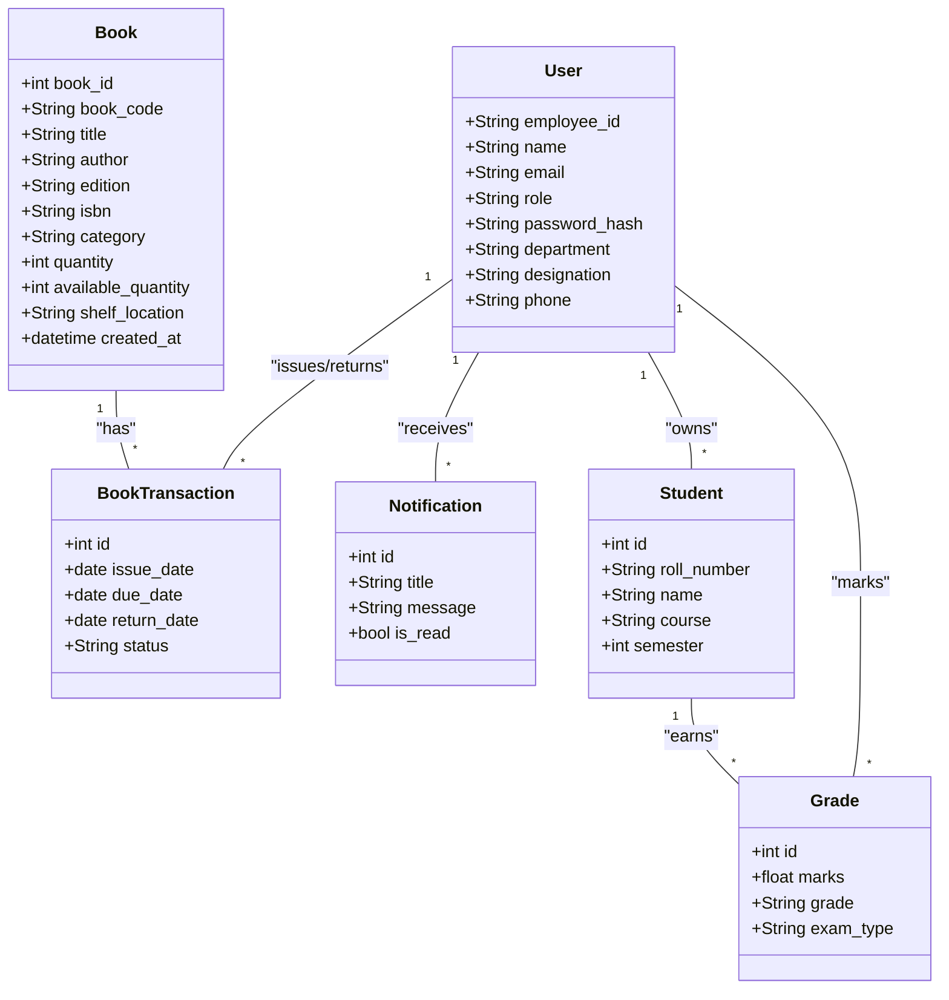
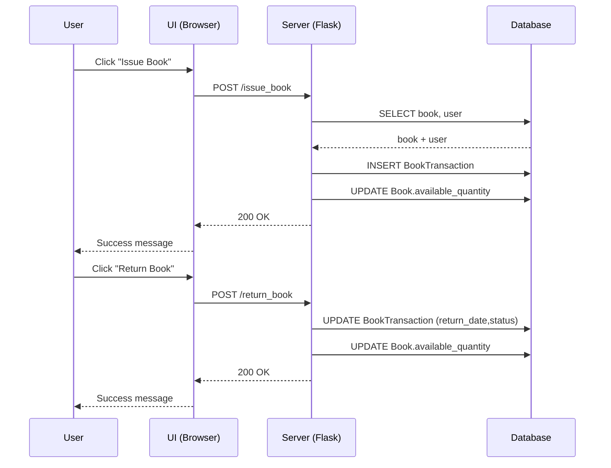
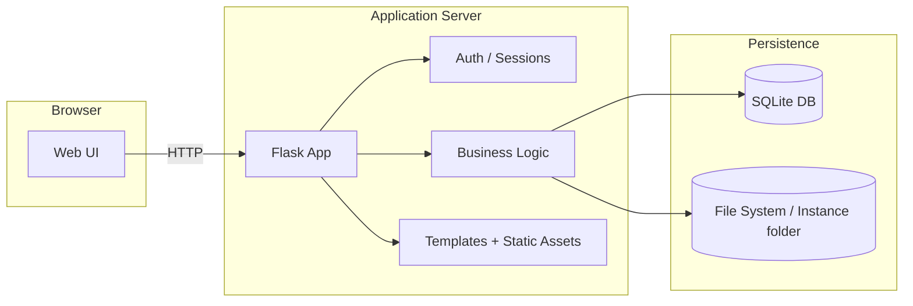

# Architecture Diagrams

## 1. Entity Relationship Diagram (ERD)



## 2. Data Flow Diagrams (DFD)

### 2.1 Level 0 (Context)

```mermaid
flowchart LR
    A[User Browser] -->|HTTP/S| B[Web App (Flask)]
    B -->|SQL| C[(SQLite Database)]
    B -->|Email/SMS| D[External Notification Service]
```

### 2.2 Level 1 (Core Subsystems)

```mermaid
flowchart TD
    subgraph UI [User Interface]
        U1[Login/Logout]
        U2[Dashboard]
        U3[Library]
        U4[Academics]
        U5[Finance]
        U6[Notifications]
    end

    subgraph App [Flask Application]
        A1[Auth Service]
        A2[Library Service]
        A3[Attendance Service]
        A4[Academics Service]
        A5[Payroll & Expenses]
        A6[Notification Service]
    end

    subgraph DB [(SQLite)]
        D1[Users]
        D2[Books + Transactions]
        D3[Attendance]
        D4[Students + Grades]
        D5[Finance]
        D6[Notifications]
    end

    U1 --> A1
    U2 --> A1
    U3 --> A2
    U4 --> A4
    U5 --> A5
    U6 --> A6

    A1 --> D1
    A2 --> D2
    A3 --> D3
    A4 --> D4
    A5 --> D5
    A6 --> D6

    %% Cross-service interaction
    A1 --> A6
    A2 --> A6
    A4 --> A6
    A5 --> A6
```

### 2.3 Level 2 (Subsystem Detail)

#### 2.3.1 Library Subsystem

```mermaid
flowchart TD
    subgraph Library [Library Service]
        L1[View Books]
        L2[Issue Book]
        L3[Return Book]
        L4[Search / Filter]
        L5[Inventory Update]
    end

    subgraph DB[(SQLite)]
        B[Books Table]
        T[BookTransactions Table]
    end

    L1 --> B
    L2 --> B
    L2 --> T
    L3 --> T
    L3 --> B
    L4 --> B
    L5 --> B
```

#### 2.3.2 Attendance Subsystem

```mermaid
flowchart TD
    subgraph Attendance [Attendance Service]
        A1[Mark Attendance]
        A2[View Attendance]
        A3[Generate Reports]
    end

    subgraph DB[(SQLite)]
        AT[Attendance Table]
        S[Students Table]
    end

    A1 --> AT
    A2 --> AT
    A2 --> S
    A3 --> AT
    A3 --> S
```

#### 2.3.3 Finance Subsystem

```mermaid
flowchart TD
    subgraph Finance [Payroll & Expenses]
        F1[Create Salary Record]
        F2[Submit Expense]
        F3[Approve Expense]
        F4[Generate Reports]
    end

    subgraph DB[(SQLite)]
        SAL[Salaries Table]
        EXP[Expenses Table]
        USR[Users Table]
    end

    F1 --> SAL
    F2 --> EXP
    F3 --> EXP
    F4 --> SAL
    F4 --> EXP
    F1 --> USR
    F2 --> USR
    F3 --> USR
```

## 3. Deployment Diagram

```mermaid
flowchart LR
    subgraph Client
        U[User Browser]
    end

    subgraph Server[Application Server]
        A[Flask App (WSGI)]
        N[Gunicorn / uWSGI]
        W[Static Files]
    end

    subgraph Data[Persistence]
        DB[(SQLite DB)]
        FS[(Instance / Backups)]
    end

    subgraph Infra[Infrastructure]
        H[Host / VM / Container]
        L[Load Balancer (optional)]
    end

    U -->|HTTP/HTTPS| L
    L --> A
    A --> N
    N --> DB
    N --> FS
    H --> A
    H --> DB
    H --> FS
```

## 4. UML Diagrams (Mermaid)

### 3.1 Class Diagram (Core Domains)



### 3.2 Sequence Diagram (Book Issue / Return)



### 3.3 Component Diagram (High-level)



## 4. Notes
- Diagrams are written in **Mermaid** so they render automatically in many Markdown viewers (including GitHub and VS Code).
- You can extend the ERD with more entities (e.g., `ExpenseCategory`, `Department`, `ExamType`) as needed.
- The DFD Level 1 shows the major subsystems; for deeper detail, add Level 2 diagrams per subsystem.
- The sequence diagram demonstrates the main user flows (login, book issue/return, etc.).

## 5. Exporting Diagrams as Images

### 5.1 Files Provided
The following Mermaid source files are available under `srs/diagrams/`:

- `erd.mmd`
- `dfd_level0.mmd`, `dfd_level1.mmd`, `dfd_library.mmd`, `dfd_attendance.mmd`, `dfd_finance.mmd`
- `deployment.mmd`
- `class_diagram.mmd`
- `sequence_book_issue_return.mmd`
- `component.mmd`

### 5.2 Rendering (Mermaid CLI)
To convert Mermaid diagrams into SVG/PNG, you can use **Mermaid CLI** (`mmdc`).

#### Install (requires Node.js + npm)
```bash
npm install -g @mermaid-js/mermaid-cli
```

#### Render an image
```bash
mmdc -i srs/diagrams/erd.mmd -o srs/diagrams/erd.svg
mmdc -i srs/diagrams/dfd_level1.mmd -o srs/diagrams/dfd_level1.png
```

### 5.3 Notes
- If `mmdc` is not found, install Node.js and npm first.
- You can render all diagrams with a simple shell loop once `mmdc` is installed:

```bash
for src in srs/diagrams/*.mmd; do
  out="${src%.mmd}.svg"
  mmdc -i "$src" -o "$out"
done
```
